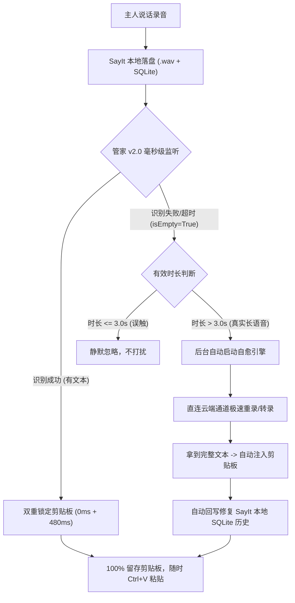

# 🎙️ SayIt 智能语音转文字与剪贴板自愈保底系统 SOP

> **💡 核心宗旨**：消除一切由于输入法冲突、焦点丢失、网络波动或 WebSocket 心跳超时导致的“语音丢失与转录失败”痛点。无论在任何窗口说话，文字 100% 自动锁定并保留在 Windows 剪贴板中；遇网络故障自动后台接管重试，免去一切手动翻找与二次识别。

---

## 📊 一、 资产全景与数据底账（2026-08-25 审计实测）

| 指标维度 | 真实数据 / 存储位置 | 意义与说明 |
| :--- | :--- | :--- |
| **本地录音存放路径** | `C:\Users\1\AppData\Local\com.sayit.app\audio` | 存放所有按键/免提录制的原始 `.wav` 高清音频 |
| **本地 SQLite 数据库** | `C:\Users\1\AppData\Local\com.sayit.app\sayit.db` | 记录每条语音转录流水、ASR原始识别、LLM润色文本与配置 |
| **录音文件总数量** | **779 个** `.wav` 音频文件 | 历史累计录音总量 |
| **录音占用磁盘空间** | **1.82 GB** (1,820.7 MB) | 纯本地存储，安全不丢失 |
| **最早开始录音时间** | **2026 年 8 月 4 日 09:38:05** (`msdzo1xaug2g.wav`) | 主人使用 SayIt 的初始时间点 |
| **累计使用时间跨度** | **21 天 12 小时 7 分钟** (整整 3 周时间) | 长期稳定主力生产力工具 |
| **历史累计语音时长** | **60,733 秒**（约 **16.87 小时** 纯发音时长） | 数据来源：`sayit.db` -> `app_settings` |
| **历史累计转录文字** | **228,761 字**（约 **22.8 万字**） | 数据来源：`sayit.db` -> `app_settings` |

---

## 🔍 二、 核心痛点与深层机理复盘

### 1. 痛点 A：原生 SayIt 的 400ms 剪贴板“自毁还原”机制
* **原生机制**：SayIt 识别出文字后，将其写入 Windows 剪贴板 ➔ 模拟按键 `Ctrl + V` 粘贴 ➔ **在 400ms 后自动将剪贴板还原为说话前的内容**。
* **崩溃场景**：当目标窗口为管理员权限窗口（如部分终端）、无焦点桌面、全屏应用或非标准文本框时，SayIt 的模拟粘贴会直接失效；400ms 后剪贴板被它强行还原，导致**屏幕上没出字，剪贴板里也没有，整段长语音彻底白说**。

### 2. 痛点 B：长语音网络抖动引发的“心跳超时（无有效声音）”假死
* **实战复盘（2026-08-25 21:35 案例）**：
  * 主人录制了一条时长为 249.2 秒（按住 273.5 秒）的详尽长语音（`mt8pj2h1uk3u.wav`）。
  * 录音结束后推流至云端 WebSocket 服务（`wss://sayitapp.site/ws/transcribe`）。在服务端深度推理过程中，客户端于 21:34:31 遭遇网络心跳超时断开 (`heartbeat timeout code 4000`)。
  * 45 秒后 SayIt 本地超时熔断 (`Processing timed out`)，错误地将该记录标记为 `isEmpty: true`，并在 UI 弹出“无有效声音”。
* **原手动救火代价**：
  * 主人必须手动点开 SayIt 历史记录界面；
  * 历史记录列表加载卡顿，需等待数秒甚至半分钟刷新；
  * 手动在几十条记录中定位到失败记录，点击“重新识别”；
  * 等待转录成功后，再点击“全部文字”或“复制”，最后手动粘贴。心流被打断，极度繁琐。

### 3. 痛点 C：极短误触产生的无声记录干扰
* **实战复盘（2026-08-25 21:37 案例）**：
  * 主人误触按键点开又立即关闭，录音时长仅 2.19 秒（`mt8pmaggx1nv.wav`），ASR 识别为空。
  * 此类误触属于正常偶发噪音，不需要进行重试与多余处理。

---

## ⚡ 三、 解决方案：SayIt 剪贴板保底 & 智能自愈管家 v2.0

银月开发的独立常驻守护进程位于：
`C:\Users\1\Desktop\我的软件\SayIt-Clipboard-Guardian`

### 核心自愈三大法宝：
1. **0ms + 480ms 双重加固写入**：
   * 第一次毫秒级即时写入剪贴板；
   * 等待 480ms（精准穿透 SayIt 自身的 400ms 还原动作），再次强制覆盖锁定，彻底粉碎“剪贴板自毁”问题。
2. **失败自动补漏与异步自愈**：
   * 监听到 `isEmpty: true` 且时长 > 3.0 秒时，后台独立线程立即接管；
   * 读取本地保存的高清 `.wav` 文件，直连云端 ASR/LLM 端点极速重算；
   * 产出文字后自动注入 Windows 剪贴板，并回写修复 `sayit.db`。主人无需任何操作，几秒后直接 `Ctrl + V` 就能出字！
3. **极短误触智能过滤**：
   * ≤ 3.0 秒且无内容的短音频直接放行，零资源占用。

---

## 🚀 四、 运维与常用控制命令

所有控制程序已在桌面 `我的软件/SayIt-Clipboard-Guardian` 中封装为绿色一键脚本：

| 控制脚本 / 文件 | 作用说明 |
| :--- | :--- |
| **`🚀 启动SayIt剪贴板保底管家.bat`** | 后台静默拉起管家（内存 < 20MB，CPU 0.00%） |
| **`🛑 停止SayIt剪贴板保底管家.bat`** | 安全终止后台常驻守护进程 |
| **`📊 查看运行状态与最新转录.bat`** | 实时查看管家运行状态及最新 5 条语音识别流水 |
| **`⚙️ 设置开机自启动.bat`** | 将管家注册为 Windows 开机启动，开机即全自动守护 |
| **`❌ 取消开机自启动.bat`** | 从开机自启动项中移除 |

---

## 📂 五、 关联路径与资产清单

- **管家程序根目录**：`C:\Users\1\Desktop\我的软件\SayIt-Clipboard-Guardian`
- **核心守护脚本**：`C:\Users\1\Desktop\我的软件\SayIt-Clipboard-Guardian\scripts\sayit_clipboard_guardian.py`
- **运行日志文件**：`C:\Users\1\Desktop\我的软件\SayIt-Clipboard-Guardian\logs\guardian.log`
- **SayIt 数据目录**：`C:\Users\1\AppData\Local\com.sayit.app`
